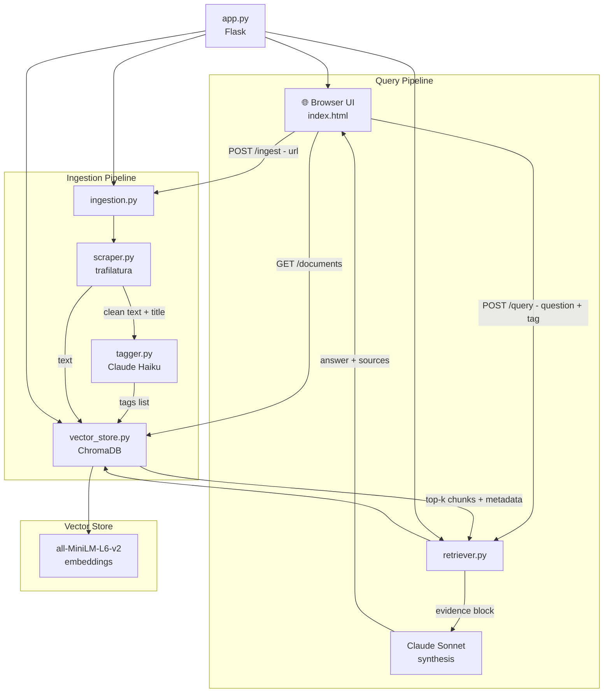

```mermaid
flowchart TD
    UI[🌐 Browser UI<br/>index.html]

    UI -->|POST /ingest - url| ING
    UI -->|POST /query - question + tag| RET
    UI -->|GET /documents| VS

    subgraph Ingestion Pipeline
        ING[ingestion.py] --> SCR[scraper.py<br/>trafilatura]
        SCR -->|clean text + title| TAG[tagger.py<br/>Claude Haiku]
        TAG -->|tags list| VS
        SCR -->|text| VS
    end

    subgraph Query Pipeline
        RET[retriever.py] --> VS
        VS -->|top-k chunks + metadata| RET
        RET -->|evidence block| SYN[Claude Sonnet<br/>synthesis]
        SYN -->|answer + sources| UI
    end

    subgraph Vector Store
        VS[vector_store.py<br/>ChromaDB]
        VS --> EMB[all-MiniLM-L6-v2<br/>embeddings]
    end

    APP[app.py<br/>Flask] --> UI
    APP --> ING
    APP --> RET
    APP --> VS
```
